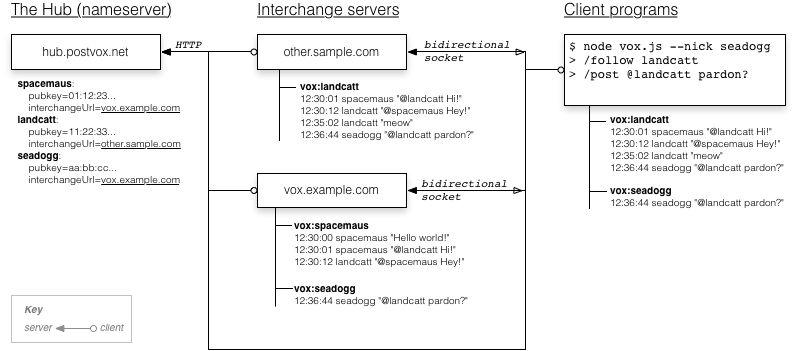

Postvox Protocol
===================

*STATUS: Draft/Proof-of-concept*
*VERSION: 0.0.0*

Postvox: A modern social network in the classical style.

The protocol is meant to be:

- Open.  Any client or server can participate in the network.

- Distributed.  No single entity should control the flow of information through
  the network.

- Simple to implement.  It should be relatively easy to create a new client or
  server.

- Extensible.  Implementations should be able to layer new functionality on top
  of the protocol without breaking backwards compatibility.

- Secure.  Encryption should be built in.

0. Overview
==============
The Postvox network is a network of databases and end-user clients. Each
database (called an **interchange server**) stores one or more streams of
"posts" to or from users, plus user metadata.

The protocol is REST-shaped, although in the typical case most of the transport
happens over a socket interface rather than via raw HTTP requests.

A typical Postvox URL looks like this:

    vox://<source>/messages/<message-id>

e.g.:

    vox://spacemaus/messages/1234

The `<source>` part of the URL is a user's nickname.  It is translated into a
real internet hostname by looking it up at the Hub.  See
[Hub protocol](Hub-Protocol.md) for details.

(One might reasonably ask why the source isn't just a real hostname to begin
with.  The reason is so that your nickname [and therefore your identity] is not
tied to any particular host or service provider.  The extra level of indirection
means that you can move your hosting provider freely without losing your history
or connections.)

Multiple `<source>` feeds can be hosted by a single Postvox server.

A user can send messages to that source:

    POST vox://spacemaus/messages
    <= { author: "landcatt", text: "Hello world!" }
    => message: { messageUrl: "vox://spacemaus/messages/12345", ... }

The feature that makes Postvox a "social" network (as opposed to a point-to-
point messaging protocol) is that users can *subscribe* to messages published by
and sent to other users.  This makes it easy and natural to be a part of larger,
loosely-connected conversations.

    POST vox://spacemaus/subscriptions
    <= { nick: "landcatt", subscriptionUrl: "vox://spacemaus" }

Furthermore, a "user" doesn't even have to correspond to a real person.  It's
possible (and reasonable) to create a "user" that is just a gathering point for
a community or topical discussion.  For example, one could create a user named
"technews".  Anyone who wished could then direct messages to @technews, and the
messages would be pushed to anyone who followed @technews.

1. Interchange server protocol
=================================
An interchange server stores and serves the message feeds for one or more users.
Clients (applications and other interchange servers) can "subscribe" to receive
push messages when a user publishes new messages or other updates.

Whenever a client wants to see a certain user's published messages, they will
connect to that user's registered interchange server.

Whenever a client wants to direct a message to a certain user, they will push
the message directly to that user's registered interchange server.

A single message may be copied to multiple places in the network:

- On the author's interchange server.
- On the interchange server's of the author's followers.
- On the client devices of the author and the followers.

In addition, a message may be "cloned" when the author directs it to one or more
other users (via "@yourname").  In this case, the clones will have a reference
to the original message's URL, but will otherwise be independent of each other.

It is the responsibility of the *client* program to ensure that a message is
pushed to the interchange servers of its explicit addressees.

Synchronization
------------------

When an interchange client is connected to an interchange server, the *client*
is responsible for ensuring that its view of the server's resources is up to
date. That is, if an interchange server queues a message for delivery to a
connected client, but the connection is broken before the client received the
message, it is the client's responsibility to (a) reconnect to the server, and
(b) request any messages it may have missed.

Generally, this is achieved by the client asking for the `syncedAt` timestamp of
the Nth message preceeding a given timestamp.  If the returned timestamp does
not match the client's view, it knows to re-fetch the stanzas from that time
period.

When messages are updated or deleted, the interchange should store a "tombstone"
at the syncedAt timestamp of the old version.  Otherwise, it is possible for the
counts to be off.

Endpoints that provide a list view accept `limit`, `syncedBefore`, and
`syncedAfter` parameters.

Timestamps
-------------
All timestamps are represented as UNIX timestamps in milliseconds.
Implementations should reserve at least 48 bits for timestamp values.

Timestamps that are named `createdAt`, `updatedAt`, or `deletedAt` are assigned
by *client* programs.  Thus they are subject to whatever clock values each
client may provide, and are not necessarily reliable values for sorting stanzas
from different clients.  The only assumption is that for any given nickname, the
`updatedAt` timestamps will be monotonically increasing.

Timestamps named `syncedAt` are assigned by the receiving interchange server.
Thus clients may sort stanzas by their `syncedAt` timestamps, as long as those
stanzas come from the same interchange server.

Input limits, validation, normalization
------------------------------------------
The protocol does not currently specify any particular limits on the size of
inputs or rate of requests.  Interchange servers may respond with a status of
`413: Request Entity Too Large` or `503 Service Unavailable`, respectively.

Nicknames must adhere to the [Hub protocol](Hub-Protocol.md).

URLs are normalized to their Unicode lowercase form.

2. Authentication and encryption
===================================

Public and private encryption keys
-------------------------------------
When a user registers a nickname at the Hub, they must include a public
encryption key: an RSA key with modulus = 2048 and exponent = 65537. (TODO is
it necessary and sufficient to spec this?)

Any user can then verify or decrypt messages from any other user by looking up
their public key at the Hub.

Interchange servers and the Hub will reject stanzas that claim to be from a
user, but whose signatures do not match the key on file with the Hub.

Signing stanzas
–-----------------

Every user-generated stanza (messages, subscriptions, status updates) is signed
with the user's corresponding private key.  Interchange servers and clients must
verify that the stanzas' signatures match the key on record at the Hub, as of
the `updatedAt` timestamp in the stanza.

Whenever `sig` appears in a parameter list, it is defined as the concatenation
of the other parameter values, sorted in alphabetical order by the parameter
name, hashed with `SHA-1`, signed by the author's private key, and base64
encoded:

    values = sortAndConcatenateFields(stanza)
    sig = base64(privateKey.hashAndSign('sha1', values))

Integer and timestamp values are decimal encoded when concatenated.  Boolean
values are represented as `"true"` or `"false"`.

Interchange servers must reject any stanza whose signature is invalid.  If an
interchange server receives stanza with an invalid signature, it must respond
with a status of `403: Forbidden`.

> TODO: private feeds, encrypted stanzas, private group feeds

3. Accessing interchange endpoints
=====================================
Endpoints can be accessed over a socket connection (currently whatever is
implemented by `socket.io`) or via an HTTP request:

#### Socket commands

When sending a command over a socket connection, the command stanza must have a
event name of `"VOX"`, and its data must be a JSON object with these fields:

Name | Type | Details
:----|:-----|:-------
method  | String | The HTTP-like method requested, e.g., "GET" or "POST".
url     | URL | The `vox:` URL being requested, e.g. "vox://spacemaus/messages".
payload | Object | The data payload of the command.  See the **Parameters** sections in the documentation for the individual endpoints below.

#### HTTP commands

When sending a command via an HTTP request, the URL must have these query
parameters:

Name | Type | Details
:----|:-----|:-------
source | String | The `<source>` of the equivalent `vox:` URL.  E.g., the URL "vox://spacemaus/messages" translates into "http://example.com/messages?source=spacemaus".

#### Status codes
Status codes for both the socket and HTTP endpoints are HTTP status codes.

Common codes:

- 200: OK.
- 400: Client error.  Probably a missing or poorly-formatted parameter.
- 404: Not found.  Either a non-existent user, or a non-existent endpoint.
- 403: Not authorized.  The `sig` field does not match the expected signature.
- 409: Conflict.  Either a too-old `updatedAt` timestamp or a duplicate transaction ID was provided.
- 500: Server error.
- 503: Not available.  Possibly due to rate-limiting.

#### NOTE

The Postvox protocol does not specify endpoints for certain things that
a end-user client would probably like (for example, muting replies to a thread).
Those are the purview of an end-client protocol, which may or may not be a
superset of the interchange protocol.  The interchange protocol is specifically
for services that are needed for the peer-to-peer exchange of streams and user
metadata.

4. Interchange endpoints
===========================

- [Begin or resume a session](#begin-or-resume-a-session)
- [Request push notifications when resources are updated](#request-push-notifications-when-resources-are-updated)
- [Notify the server and listeners that a user is following a resource](#notify-the-server-and-listeners-that-a-user-is-following-a-resource)
- [Create or update a message](#create-or-update-a-message)
- [List existing messages](#list-existing-messages)
- [List replies to a specific message](#list-replies-to-a-specific-message)
- [List replies to a message thread](#list-replies-to-a-message-thread)
- [Get the details of an existing message](#get-the-details-of-an-existing-message)
- [List the subscribers to a given URL](#list-the-subscribers-to-a-given-url)
- [List the subscriptions of a user](#list-the-subscriptions-of-a-user)
- [Update a user's profile details](#update-a-users-profile-details)
- [Read a user's profile details](#read-a-users-profile-details)
- [Update a user's status](#update-a-users-status)
- [Read a user's status](#read-a-users-status)
- [Block a user](#block-a-user)
- [List a source's blocks](#list-a-sources-blocks)

- [Stanzas](#5-stanzas)
    - [UserProfile stanza](#userprofile-stanza)
    - [UserStatus stanza](#userstatus-stanza)
    - [Message stanza](#message-stanza)
    - [Subscription stanza](#subscription-stanza)
    - [Block stanza](#block-stanza)

Begin or resume a session
-----------------------------

    POST vox://<source>/session
    POST vox://<source>/session/<sessionId>

A "session" is a relationship between an interchange server and client.  It is
meant to be long-lived.  If a client wants push messages from the server, it
needs to first establish a session.  Whenever the client reconnects to the
server, it can reestablish that same session to resume receiving push messages.

#### Parameters

Name | Type | Details
:----|:-----|:-------
version   | String | The version of the Postvox protocol that the client understands.
agent     | String | The client's agent string.  Contents are unspecified.
[webhook] | URL | If specified, then messages will be pushed by making a POST request to this URL.  May not be supported by all servers.

#### Returns

Name | Type | Details
:----|:-----|:-------
status         | int | The status code of the result.  See [Status codes](#status-codes).
version        | String | The version of the Postvox protocol that the server understands.
agent          | String | The server's agent string.  Contents are unspecified.
[newSessionId] | String | If a new session was created, then its ID is returned.  Even if a client passes a `sessionId` in its request, it is not guaranteed that the server will be able to resume that session.  Thus, clients must always check this parameter and -- if it is set -- reissue any `ROUTE` commands it may need.
[error]        | String | If `status` is not 200, a string describing the error.

Request push notifications when resources are updated
--------------------------------------------------------

    POST vox://<source>/session/<sessionId>/routes

Requests push notifications for any stanzas published to the given `routeUrl`.  The
client must first create a session before requesting notifications.

See the **Publishes** sections of the other commands to see which stanzas will
be delivered.

The `/routes` and `/subscriptions` endpoints appear very similar, but they serve
different purposes.  A `/subscriptions` endpoint broadcasts a Subscription
stanza to anyone listening, but has no effect what actually gets pushed to the
client.  A `/routes` endpoint requests that the server deliver the stanzas to a
session client, but does not tell other listeners about it.

Valid `routeUrl` patterns:

    vox://<source>
    vox://<source>/messages
    vox://<source>/messages/<message-id>/thread
    vox://<source>/messages/<message-id>/replyTo
    vox://<source>/profile
    vox://<source>/status
    vox://<source>/subscriptions
    vox://<source>/subscribers
    vox://<source>/blocks

#### Parameters

Name | Type | Details
:----|:-----|:-------
routeUrl  | URL | The URL of the resource to route.
weight    | int | The weight of the route.  1 or 0, with 1 meaning 'route' and 0 meaning 'do not route'.
updatedAt | Timestamp (ms) | The timestamp of the command.  For a given `nick` and URL, the server will accept only commands with a timestamp larger than the largest `updatedAt` received for the given URL so far.

#### Returns

Name | Type | Details
:----|:-----|:-------
status  | int | The status code of the result.  See [Status codes](#status-codes).
[error] | String | If `status` is not 200, a string describing the error.

Notify the server and listeners that a user is following a resource
----------------------------------------------------------------------

    POST vox://<source>/subscribers

Valid `subscriptionUrl` patterns (same as `routeUrl` for `/routes`):

    vox://<source>
    vox://<source>/messages
    vox://<source>/messages/<message-id>
    vox://<source>/messages/<message-id>/thread
    vox://<source>/messages/<message-id>/replyTo
    vox://<source>/profile
    vox://<source>/status
    vox://<source>/subscriptions
    vox://<source>/subscribers
    vox://<source>/blocks

#### Parameters

Name | Type | Details
:----|:-----|:-------
subscriptionUrl | URL | The URL of the resource that the user is following.
nick            | String | The nickname of the user who is subscribing.
weight          | int | The weight of the subscription.  1 or 0, with 1 meaning 'subscribe' and 0 meaning 'unsubscribe'.
updatedAt       | Timestamp (ms) | The timestamp of the command.  For a given `nick` and URL, the server will accept only commands with a timestamp larger than the largest `updatedAt` received for the given URL so far.
sig             | String | The Base64 encoded signature (see [Authentication](#2Authentication-and-encryption)).

#### Returns

Name | Type | Details
:----|:-----|:-------
status       | int | The status code of the result.  See [Status codes](#status-codes).
subscription | [Subscription](#Subscription-stanza) | The subscription that was created.
[error]      | String | If `status` is not 200, a string describing the error.

#### Publishes

Publishes a [Subscription stanza](#Subscription-stanza) to these paths:

    vox://<source>/subscribers
    vox://<source> (if `nick` == `source`)
    vox://<source>/subscriptions (if `nick` == `source`)

Create or update a message
-----------------------------

    POST vox://<source>/messages[/<message-id>]

E.g., `POST vox://@spacemaus/messages/1000`.

If `<message-id>` is not given, then the server will assign a new, unique ID for
it.

#### Parameters

Name | Type | Details
:----|:-----|:-------
author    | String | The nickname of the author.  E.g., `@spacemaus`.
source    | String | The source, identical to `source` in the messageUrl.  This is included for authentication purposes.  `messageUrl` is assigned by the server and therefore cannot be signed by the author beforehand.
[clone]   | URL | The URL of the original message from which this message is being cloned.
[thread]  | URL | The URL of the first message in a thread of replies.  If unset, and `replyTo` is set, then its value will be copied from `replyTo`.
[replyTo] | URL | The URL of the message being replied to.
text      | String | The body text of the message.
[title]   | String | An optional title.
[userUrl] | String | An arbitrary URL associated with the message.
[etc]     | String | An optional payload.  Can be used by clients to extend the message with custom fields.  Probably JSON encoded.
updatedAt | Timestamp (ms) | The timestamp of the update.  If the message already exists, then the server will only accept updates that have an `updatedAt` that is larger than its current `updatedAt` value.
sig       | String | The Base64 encoded signature (see [Authentication](#2Authentication-and-encryption)).

#### Returns

Name | Type | Details
:----|:-----|:-------
status         | int | The status code of the result.  See [Status codes](#status-codes).
message        | [Message](#Message-stanza) | The message that was created.
[error]        | String | If `status` is not 200, a string describing the error.

#### Publishes

Publishes a [Message stanza](#Message-stanza) to these paths:

    vox://<source>
    vox://<source>/messages
    <replyTo>/replyTo (if `replyTo` is given)
    <thread>/thread (if `thread` is given)

List existing messages
-------------------------

    GET vox://<source>/messages

#### Parameters

Name | Type | Details
:----|:-----|:-------
[limit]        | int | The maximum number of messages to return.
[syncedBefore] | Timestamp (ms) | (Optional) Return only messages received by the server before this timestamp (inclusive).  Defaults to infinity.
[syncedAfter]  | Timestamp (ms) | (Optional) Return only messages received by the server after this timestamp (inclusive).  Defaults to 0.

#### Returns

Name | Type | Details
:----|:-----|:-------
status         | int | The status code of the result.  See [Status codes](#status-codes).
messages       | [Message](#Message-stanza)[] | The array of message stanzas requested.
[error]        | String | If `status` is not 200, a string describing the error.

List replies to a specific message
-------------------------------------

    GET vox://<source>/messages/<message-id>/replyTo

#### Parameters and Returns

See [List existing messages](#list-existing-messages)

List replies to a message thread
-------------------------------------

    GET vox://<source>/messages/<message-id>/thread

#### Parameters and Returns

See [List existing messages](#list-existing-messages)

Get the details of an existing message
-----------------------------------------

    GET vox://<source>/messages/<message-id>

#### Parameters

Name | Type | Details
:----|:-----|:-------
[syncedAfter] | Timestamp (ms) | If set, then return the message only if it was synced after this timestamp.  Otherwise, return `status: 304`.

#### Returns

Name | Type | Details
:----|:-----|:-------
status  | int | The status code of the result.  See [Status codes](#status-codes).
message | message | The requested message.
[error] | String | If `status` is not 200, a string describing the reason.

List the subscribers to a given URL
--------------------------------------
Any URL that is a valid `subscriptionUrl` or `routeUrl`, with "/subscribers"
appended:

    GET vox://<source>/subscribers
    GET vox://<source>/messages/subscribers
    GET vox://<source>/messages/:messageId/subscribers
    GET vox://<source>/messages/:messageId/thread/subscribers
    GET vox://<source>/messages/:messageId/replyTo/subscribers
    GET vox://<source>/profile/subscribers
    GET vox://<source>/status/subscribers
    GET vox://<source>/subscribers/subscribers
    GET vox://<source>/subscriptions/subscribers

#### Parameters

Name | Type | Details
:----|:-----|:-------
limit          | int | The maximum number of subscriptions to return.
[syncedBefore] | Timestamp (ms) | (Optional) Return only subscriptions received by the server before this timestamp (inclusive).  Defaults to infinity.
[syncedAfter]  | Timestamp (ms) | (Optional) Return only subscriptions received by the server after this timestamp (inclusive).  Defaults to 0.

#### Returns

Name | Type | Details
:----|:-----|:-------
status              | int | The status code of the result.  See [Status codes](#status-codes).
subscriptions       | [Subscription](#Subscription-stanza)[] | The requested subscriptions.
[error]             | String | If `status` is not 200, a string describing the error.

List the subscriptions of a user
-------------------------------------

    GET vox://<source>/subscriptions

#### Parameters and Returns

See [List the subscribers to a given URL](#list-the-subscribers-to-a-given-url)

Update a user's profile details
----------------------------------

    POST vox://<source>/profile

**NOTE**: This endpoint updates a user's profile details (e.g. `pubkey` and
`interchangeUrl`), which should change rarely.  There is a sibling endpoint
`/status` that updates a user's current status, which may change frequently.

**NOTE 2**: This is an exact copy of the data registered at the Hub.  Posting it
to the Hub and to the user's interchange server notifies any of the user's
followers of the update immediately, which is important when either the user's
`pubkey` or `interchangeUrl` change.

#### Parameters

Name | Type | Details
:----|:-----|:-------
nick           | String | The nickname of the user.  Must be identical to `<source>`; in the URL.
interchangeUrl | URL | The URL of the user's interchange server.
pubkey         | String | The user's public key.
about          | String | Details about the user.  Probably a string in JSON format.
updatedAt      | Timestamp (ms) | The timestamp of the update.  The server will ignore any updates that have a smaller `updatedAt` than the largest it has received so far.
sig            | String | The Base64 encoded signature (see [Authentication](#2Authentication-and-encryption)).

#### Returns

Name | Type | Details
:----|:-----|:-------
status      | int | The status code of the result.  See [Status codes](#status-codes).
userProfile | [UserProfile](#UserProfile-stanza) | The current UserProfile.
[error]     | String | If `status` is not 200, a string describing the error.

#### Publishes

Publishes a [UserProfile stanza](#UserProfile-stanza) to these paths:

    vox://<source>
    vox://<source>/profile

Read a user's profile details
-----------------------

    GET vox://<source>/profile

#### Parameters

Name | Type | Details
:----|:-----|:-------
[syncedAfter] | Timestamp (ms) | If set, then return the user's profile only if it was synced after this timestamp.  Otherwise, return `status: 304`.

#### Returns

Name | Type | Details
:----|:-----|:-------
status      | int | The status code of the result.  See [Status codes](#status-codes).
userProfile | UserProfile | The UserProfile of the requested user.
[error]     | String | If `status` is not 200, a string describing the error.

Update a user's status
-------------------------

    POST vox://<source>/status

#### Parameters

Name | Type | Details
:----|:-----|:-------
nick       | String | The nickname of the user.  Generally, this should be identical to `<source>`.
statusText | String | The user-provided status text.
isOnline   | bool | Whether the user can be considered "online".
updatedAt  | Timestamp (ms) | The timestamp of the update.  The server will ignore any updates that have a smaller `updatedAt` than the largest it has received so far.
sig        | String | The Base64 encoded signature (see [Authentication](#2Authentication-and-encryption)).

#### Returns

Name | Type | Details
:----|:-----|:-------
status     | int | The status code of the result.  See [Status codes](#status-codes).
userStatus | [UserStatus](#UserStatus-stanza) | The current UserStatus.
[error]    | String | If `status` is not 200, a string describing the error.

#### Publishes

Publishes a [UserStatus stanza](#UserStatus-stanza) to these paths:

    vox://<source>
    vox://<source>/status

Read a user's status
-----------------------

    GET vox://<source>/status

#### Parameters

Name | Type | Details
:----|:-----|:-------
[syncedAfter] | Timestamp (ms) | If set, then return the user's status only if it was synced after this timestamp.  Otherwise, return `status: 304`.

#### Returns

Name | Type | Details
:----|:-----|:-------
status     | int | The status code of the result.  See [Status codes](#status-codes).
userStatus | [UserStatus](#UserStatus-stanza) | The UserStatus of the requested user.
[error]    | String | If `status` is not 200, a string describing the error.

Block a user
---------------

    POST vox://<source>/blocks

#### Parameters

Name | Type | Details
:----|:-----|:-------
blocker        | String | The nickname of the user blocking.
blockee        | String | The nickname of the user blocked.
blocked        | bool | Whether to block or unblock the user.
[updatedAt]    | Timestamp (ms) | The timestamp of the update.  The server will ignore any updates that have a smaller `updatedAt` than the largest it has received so far.
sig            | String | The Base64 encoded signature, signed by `blocker` (see [Authentication](#2Authentication-and-encryption)).

#### Returns

Name | Type | Details
:----|:-----|:-------
status     | int | The status code of the result.  See [Status codes](#status-codes).
userStatus | UserStatus | The UserStatus of the requested user.
[error]    | String | If `status` is not 200, a string describing the error.

#### Publishes

Publishes a [Block stanza](#Block-stanza) to these paths:

    vox://<source>/blocks

**NOTE** for client implementors: when a block stanza is received, it should be
applied to the blocker's followers and republished to their followers'
followers.  HOWEVER, it should NOT be republished for any followers who already
have the block installed.

**NOTE 2** for client implementors: this is a potential DoS attack vector, where
relatively small requests can potentially burn a lot of server-side cycles and
network traffic.  Block propagation should therefore be heavily rate-limited.
[Is this true when propagation is limited to two hops?  In any case, it still
feels like a vector for shenanigans of various types.]

**NOTE 3** for client implementors: block stanzas will be signed with the
*original* blocker's private key.

List a source's blocks
-----------------------

    GET vox://<source>/blocks

#### Parameters

Name | Type | Details
:----|:-----|:-------
limit          | int | The maximum number of blocks to return.
[syncedBefore] | Timestamp (ms) | (Optional) Return only blocks received by the server before this timestamp (inclusive).  Defaults to infinity.
[syncedAfter]  | Timestamp (ms) | (Optional) Return only blocks received by the server after this timestamp (inclusive).  Defaults to 0.

#### Returns

Name | Type | Details
:----|:-----|:-------
status  | int | The status code of the result.  See [Status codes](#status-codes).
blocks  | Block[] | The requested blocks.
[error] | String | If `status` is not 200, a string describing the error.

5. Stanzas
=============
Stanzas are the network representation of Postvox entities, such as messages and
subscriptions.

UserProfile stanza
---------------------
Identified by the event name `"USER_PROFILE"`.

Name | Type | Details
:----|:-----|:-------
nick           | String | The nickname of the user.
interchangeUrl | URL | The URL of the user's interchange server.
pubkey         | String | The user's public key.
about          | String | Details about the user.  Probably a string in JSON format.
updatedAt      | Timestamp (ms) | The timestamp of the update.
hubCreatedAt   | Timestamp (ms) | The timestamp when this profile was first received by the Hub.
hubSyncedAt    | Timestamp (ms) | The timestamp that the profile was received by the Hub.
syncedAt       | Timestamp (ms) | The timestamp that the profile was received by the interchange server.
sig            | String | The Base64 encoded signature (see [Authentication](#2Authentication-and-encryption)).
hubSig         | String | The Base64 encoded signature from the Hub (see [Authentication](#2Authentication-and-encryption)).

#### `sig` fields

- about
- interchangeUrl
- nick
- pubkey
- updatedAt

**NOTE** When the user's `pubkey` has changed, the `UserProfile.sig` field
notifying others of the change MUST be signed with the user's **previous**
private key.

#### `hubSig` fields

(Note that this order is not alphabetical, but is instead the list of `sig`
fields with the list of Hub-specific fields appended.)

- about
- interchangeUrl
- nick
- pubkey
- updatedAt
- hubCreatedAt
- hubSyncedAt
- sig

UserStatus stanza
--------------------
Identified by the event name `"USER_STATUS"`.

Name | Type | Details
:----|:-----|:-------
nick       | String | The nickname of the user.
statusText | String | The user-provided status text.
isOnline   | bool | Whether the user is online.
updatedAt  | Timestamp (ms) | The timestamp of the update.
sig        | String | The Base64 encoded signature (see [Authentication](#2Authentication-and-encryption)).

#### `sig` fields

- isOnline
- nick
- statusText
- updatedAt

Message stanza
-----------------
Identified by the event name `"MESSAGE"`.

Name | Type | Details
:----|:-----|:-------
messageUrl  | URL | The URL of the message.  I.e., `vox://<source>/messages/<message-id>`.
author      | String | The nickname of the author.  E.g., `spacemaus`.
source      | String | The source, identical to `source` in `messageUrl`.  This is included for authentication purposes.  `messageUrl` is assigned by the server and therefore cannot be signed by the author beforehand.
clone       | URL | The URL of the original message from which this message was cloned.
thread      | URL | The URL of the first message in a thread of replies.
replyTo     | URL | The URL of the message being replied to.
text        | String | The body text of the message.
title       | String | The user-visible title of the message.
userUrl     | String | An arbitrary URL associated with the message.
etc         | String | An optional message payload.  Can be used by clients to extend the message.  Probably JSON encoded.
createdAt   | Timestamp (ms) | The timestamp of when the message was created.
updatedAt   | Timestamp (ms) | The timestamp of when the message was last updated (set to `createdAt` if the message was never updated).  Does not include the time when messages were posted to the message.
[deletedAt] | Timestamp (ms) | The timestamp of when the message was deleted.  Unset if the message has not been deleted.
sig         | String | The Base64 encoded signature (see [Authentication](#2Authentication-and-encryption)).

#### `sig` fields

- author
- clone
- deletedAt
- etc
- replyTo
- source
- text
- thread
- title
- updatedAt
- userUrl

Subscription stanza
----------------------
Identified by the event name `"SUBSCRIPTION"`.

Name | Type | Details
:----|:-----|:-------
subscriptionUrl | URL | The URL of the subscription.
nick            | String | The nickname of the subscriber.
weight          | int | The weight of the subscription.
updatedAt       | Timestamp (ms) | The (client-provided) timestamp of the command.
sig             | String | The Base64 encoded signature (see [Authentication](#2Authentication-and-encryption)).

#### `sig` fields

- nick
- subscriptionUrl
- updatedAt
- weight

Block stanza
---------------
Identified by the event name `"BLOCK"`.

Name | Type | Details
:----|:-----|:-------
blocker            | String | The nickname of the user blocking.
blockee            | String | The nickname of the user blocked.
blocked            | bool | Whether the user is blocked.
updatedAt          | Timestamp (ms) | The timestamp of the block.
[intermediateNick] | String | If the block has been propagated via an intermediate user, then this is their nickname.  If this field is set, then the block should be propagated to `intermedateNick`'s followers.  If this field is not set, then the block should be propagated to `blocker`'s followers.
sig                | String | The Base64 encoded signature, signed by `blocker` (see [Authentication](#2Authentication-and-encryption)).

#### `sig` fields

- blocked
- blockee
- blocker
- intermediateNick
- updatedAt

